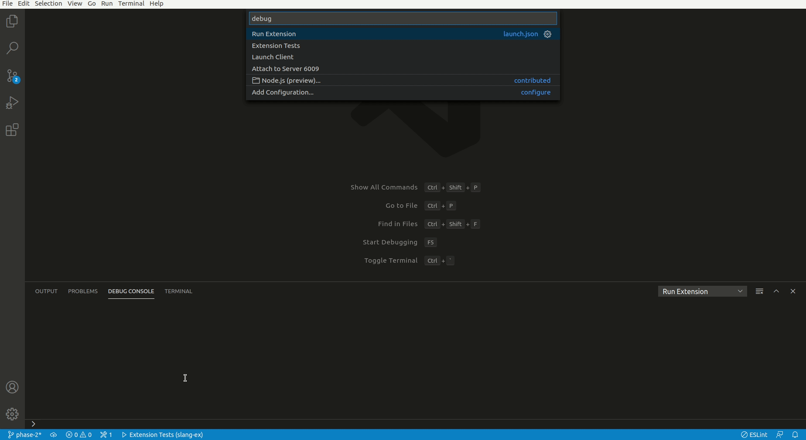
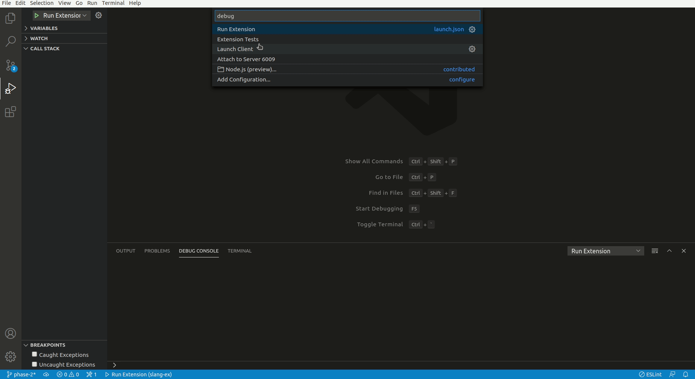

# Diagnostics for solang-vscode

The diagnostics in solang-vscode are useful to test the code before compiling
to ensure the code is correct and compiles.

### Diagnostics kick-in when you:
- Open a solidity file(.sol).
- Make changes in the opened file and save it.

### Wondering how this works?
When you open a file the client sends this doc URI to the server.
The solang-server uses solang as a backend for solidity, opens the
specified file and performs two operations:
1. Parsing the file.
2. Resolving the AST and returning any errors occured in the process.

The solang-server after recieving the diagnostics performs necessary 
transforms like conversion of messages to LSP standard types, mapping of
the line and coloumn of the messages with the file atlast forwrding it 
to the client.

### Which properties are supported:
1. Errors.
2. Information.
3. Warnings.

### Want to run some tests?
Currently the extension comes with 4 diagnostics tests which tests the extension on:

1. Coloum, Line alignment of diagnostics with respect to file.
2. Checking for correct warnings.
3. Checking for correct Information messages from the server.
4. Checking for correct error messages from the server.

### How to run these tests?
1. Build the extension (Ctrl+Shift+B).
2. Press F5 and from the bottom menu select "Extension tests".
The result should appear in the debug console.

### Testing the diagnostics

### Launching tests

The server might take a few seconds to respond during file changes.
We are working on more features, stay tuned!